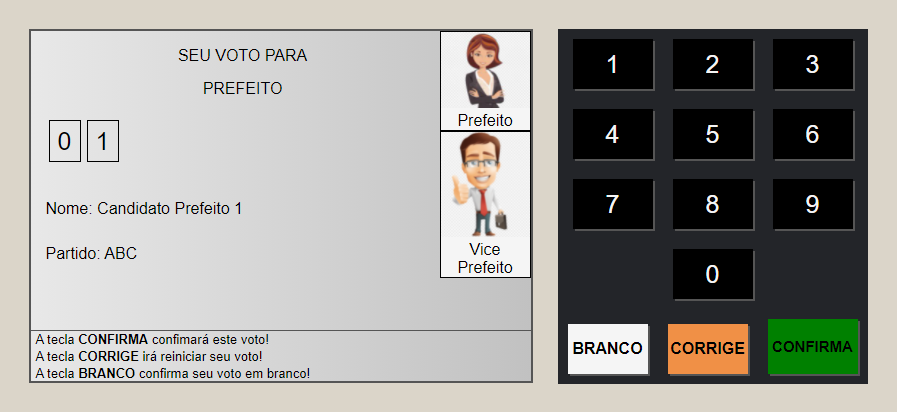
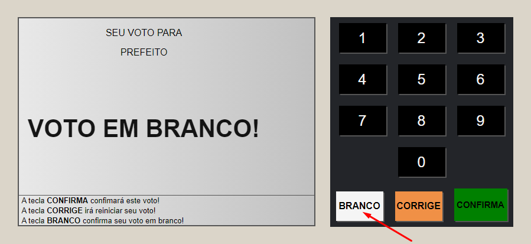

# Urna Eletrônica

## Sobre
Este projeto tem como finalidade desenvolvimento e aprendizado da linguagem Java Script.
Nele esta contido uma Urna Eletrônica que ao final dos votos realizados pelo usuário irá 
gerar um sinal sonoro representando que a votação foi finalizada. 
Aproveitando da realização deste pequeno projeto, esta sendo estudados alguns 
conceitos de HTML e também CSS
E por último estou aprendendo alguns conceitos de uso do prórpio Git Hub!!

## Layout

 

## Tecnologias utilizadas
Foram usadas apenas estruturação de linguagens e ferramenetas para Front-End
neste projeto. Elas como já citadas anteriormente são:

 - Java Script;
 - HTML;
 - CSS.

## Como contribuir
Se você é um desenvolvedor com mais experiência, sempre tem algumas dicas para dar aos mais novos,
então no que puder acrescentar ao meu trabalho e ao meu crescimento como um desenvolvedor, estarei 
sempre de portas abertas para ouvir aos conselhos e ensinamentos que tiveram para dar!!

## Autor 

 - Caio Henrique Marques da Silva
 - LinkedIn: https://www.linkedin.com/in/caio-henrique-56b713200/
 - Instagram: caiohenrique3